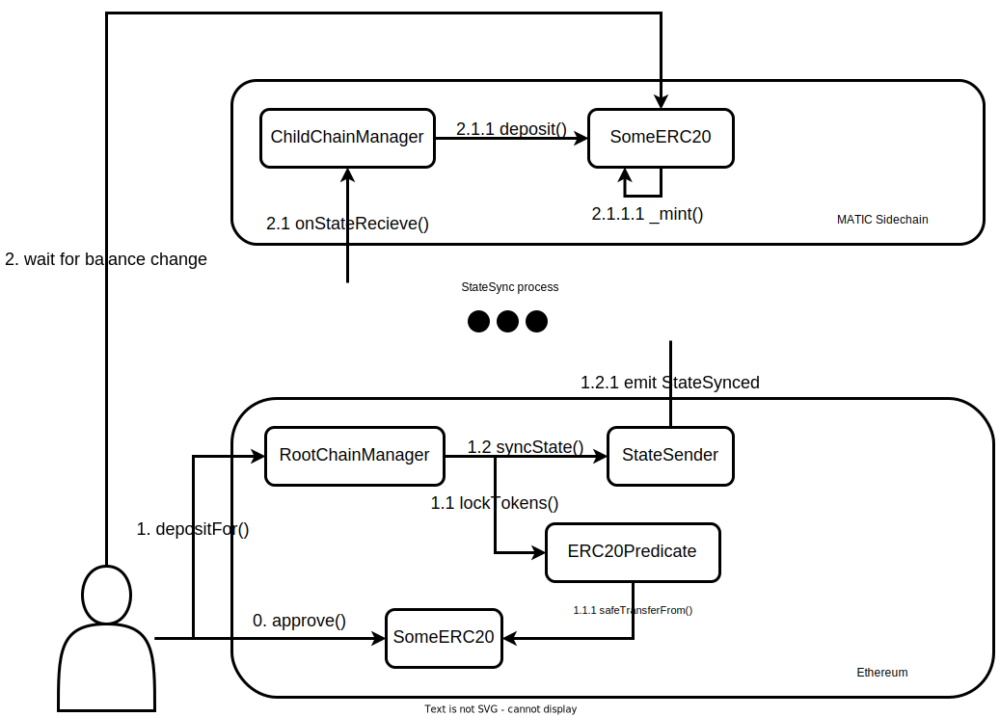
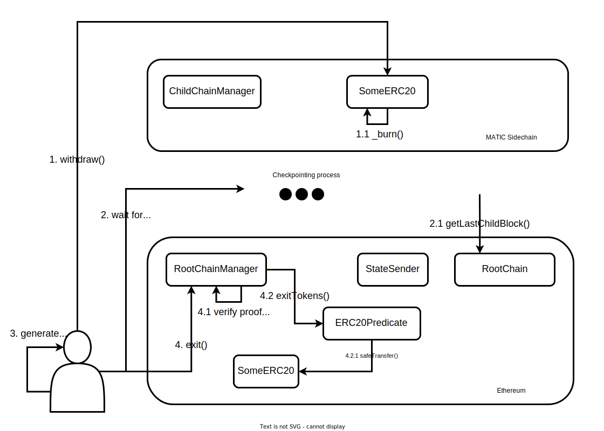

# polygon-examples

Примеры взаимодействия с [Polygon](https://polygon.technology/) из `js`.

Несмотря на наличие [MaticJS SDK](https://wiki.polygon.technology/docs/develop/ethereum-polygon/matic-js/get-started), примеры написаны в основном с использованием [ethers.js](https://docs.ethers.org/v5/) для лучшего понимания деталей реализации.

Для запуска необходимо заполнить переменные окружения в `.env.example` и выполнить команду:
```sh
source .env.example
```

## PoS Bridge

Реализован пример трансфера ERC20-токена через PoS-Bridge.

Функции для получения инстансов нужных контрактов находятся в `ethers/chain_manager.js` и `ethers/erc20.js`

Проверить баланс и allowance для токена можно, запустив `ethers/balance.js`

### Deposit



* approve:
```sh
node ethers/approve.js <amount>
# e.g. node ethers/approve.js 1.5
```

* deposit start:
```sh
node ethers/deposit.js <amount>
# output contains deposit tx hash
```

* deposit completion check:
```sh
node matic/is_deposited.js <deposit tx hash>
```

### Withdrawal



* withdraw start:
```sh
node ethers/withdraw_start.js <amount>
# output contains burn tx hash
```

* checkpoint arrival check:
```sh
node matic/is_checkpointed.js <burn tx hash>
```

* withdraw exit:
```sh
node ethers/withdraw_exit.js <burn tx hash>
```

* FULL withdraw:
```sh
node ethers/withdraw_full.js <amount>
# require time to complete (waiting for checkpoint)
```