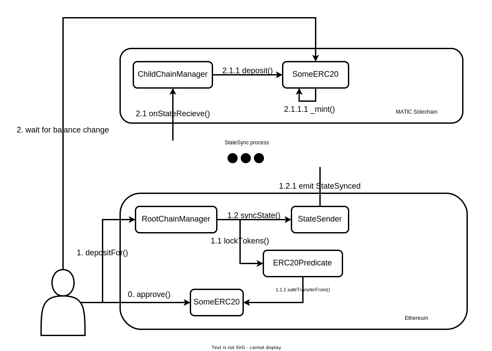

# polygon-examples

Примеры взаимодействия с [Polygon](https://polygon.technology/) из `js`.

Несмотря на наличие [MaticJS SDK](https://wiki.polygon.technology/docs/develop/ethereum-polygon/matic-js/get-started), примеры написаны в основном с использованием [ethers.js](https://docs.ethers.org/v5/) для лучшего понимания деталей реализации.

Для запуска необходимо заполнить переменные окружения в `.env.example` и выполнить команду:
```sh
source .env.example
```

## PoS Bridge

### Deposit



### Withdrawal


